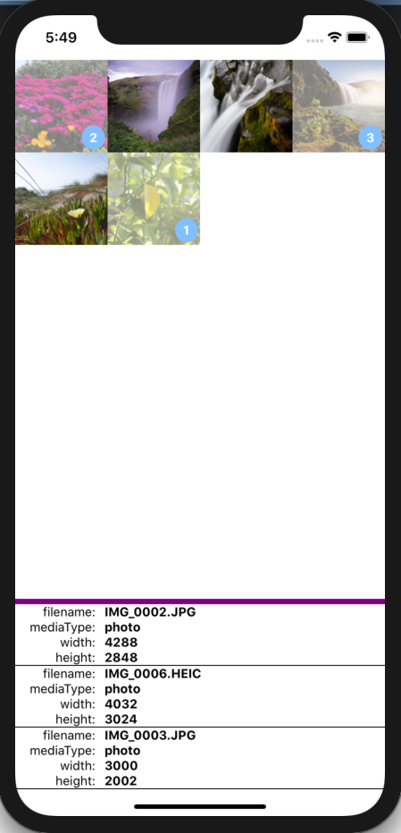

# expo-image-multi-picker-example
A demo of the use of [my fork of expo-image-picker-multiple](https://github.com/gregfenton/expo-image-picker-multiple)

To use:
1. Clone this repo to your machine: `git clone https://github.com/gregfenton/expo-image-picker-multiple-example`
2. `npm install`
3. `expo ios`  or  `expo android`

You should see a screen that resembles:

